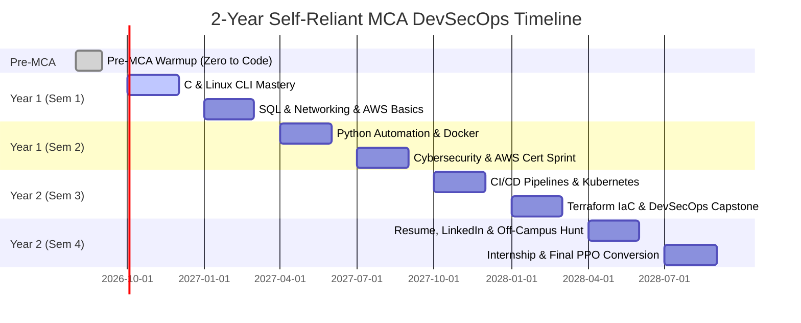

# 🗺️ 2-Year Self-Reliant MCA Master Plan: Zero Coding to DevSecOps Engineer

> **Author:** Antigravity Career Engine & VTU MCA Mentor  
> **Target Role:** DevSecOps Cloud Engineer / Cloud Security Architect  
> **Starting Point:** **Absolute Zero Coding Knowledge + Weak in Math**  
> **Institution Context:** BKIT Bhalki / Any VTU-Affiliated Engineering College  
> **Core Philosophy:** **100% College-Independent Execution** (College for Degree & GPA; Self-Study for Career & High Salary)  
> **Target Compensation:** **₹10,00,000 – ₹22,00,000 / year** (Off-Campus / Pooled Campus / Remote)  
> **File:** 21 of 21 | Category: Career Guide | Created: September 2026  

---

## ⚡ 1. The Core Philosophy: Why You MUST NOT Depend on College

If you wait for your college professors to teach you programming, you will graduate with a degree on paper and **zero hireable skills**.

### The Hard Truth About Tier-2 / Tier-3 MCA Colleges:
1. **Curriculum Lag:** University syllabi update every 4–5 years. Colleges teach syntax on blackboards or PPTs, not production engineering.
2. **Exam Orientation:** VTU semester exams test your ability to memorize definitions, draw architecture diagrams on paper, and write standard algorithms by hand.
3. **The Industry Hiring Reality:** High-paying tech companies (₹10L–₹25L+) do **not** care what percentage you scored in college, as long as you have the minimum eligibility (60%+ or 6.5+ CGPA). They hire you based on **one question only**:
   > *"Can you build, deploy, automate, and secure our cloud systems right now without breaking production?"*

### The 2-Track Strategy:
You will operate on two parallel tracks from Day 1:
- **Track A: The College Shield (25% Energy)**
  - Attend classes to maintain minimum 75% attendance.
  - Study 10–14 days before CIE internal tests and semester-end exams using VTU Question Banks.
  - Maintain a safe **8.0 – 8.5 CGPA** so no company eligibility filter can ever block you.
- **Track B: The Career Engine (75% Energy)**
  - Daily 3 to 4 hours of hands-on, practical skill-building on your laptop.
  - Follow the **"Type Every Line"** rule (never just watch videos).
  - Push real code to GitHub every single day.
  - Earn globally recognized industry certifications (AWS, CompTIA Security+).

---

## 🧠 2. Mindset Shift: Learning to Code When You Start From Zero

Starting from zero is actually your **biggest advantage**: you have no bad habits to unlearn. 

### The 4 Non-Coder Ground Rules:
1. **The "Type Every Line" Rule:** Never watch a coding tutorial like a movie on your bed. If the instructor types a command, your fingers must type that command into your terminal. Muscle memory builds intuition.
2. **Error Messages are Friends, Not Failures:** When your screen throws a red error, do not panic. Red text does not mean you are dumb; it means the computer is telling you exactly what it did not understand. Copy the error line, paste it into Google or ChatGPT/Claude, and read the explanation.
3. **The "Google First" Reflex:** Real software engineers spend 40% of their day searching documentation, StackOverflow, and GitHub issues. Learning how to search and read error logs is 80% of a DevSecOps engineer's daily work.
4. **Demystifying the "Math Fear":**
   - **Myth:** "You need advanced calculus, differential equations, and complex algebra to be a great programmer."
   - **Reality:** DevSecOps and Cloud Engineering require **logic**, not calculus! If you understand basic arithmetic (`+ - * /`), greater than/less than (`> < ==`), and simple boolean logic (`AND, OR, NOT`), you already know all the math required to earn ₹20L+ in Cloud & DevOps!

---

## 📅 3. The 24-Month Roadmap At A Glance



---

## 🚀 PHASE 0: Pre-MCA Warmup (Weeks 1 to 4) — Zero to First Code

*Goal: Break the computer fear, learn what software actually is, and write your first functioning programs.*

### Week 1: Computer Intuition & Terminal Setup
- **What to Learn:**
  - How computers execute instructions: CPU (the worker), RAM (the short-term desk), Storage/SSD (the long-term warehouse), OS (the manager).
  - Install **Visual Studio Code (VS Code)** on your laptop.
  - Install **Git for Windows** (which includes Git Bash) or set up **WSL2 (Windows Subsystem for Linux - Ubuntu)**.
- **Hands-On Exercises:**
  - Open Git Bash or terminal. Learn 7 fundamental navigation commands:
    - `pwd` (print working directory)
    - `ls` / `ls -la` (list files)
    - `cd <folder>` (change directory)
    - `mkdir my-first-project` (make directory)
    - `touch test.txt` (create empty file)
    - `cat test.txt` (read file contents)
    - `rm test.txt` (delete file)
- **Mindset Check:** You just interacted with a computer like a software engineer using text commands instead of mouse clicks!

### Week 2: First Code in Python (Variables, Types & Inputs)
- **Why Python First:** Python reads like plain English. It removes complex syntax so you can focus 100% on logic.
- **What to Learn:**
  - Variables: Storing data in labeled boxes (`name = "Rohan"`, `age = 21`).
  - Data types: Text (`str`), Whole numbers (`int`), Decimals (`float`), True/False (`bool`).
  - Output and Input: `print()` and `input()`.
- **First Hands-On Code:**
  ```python
  # Save as hello.py and run: python hello.py
  user_name = input("Enter your name: ")
  print(f"Welcome to the DevSecOps Journey, {user_name}!")
  print("You are on track to build cloud systems.")
  ```

### Week 3: Logic Building (Conditions & Loops)
- **What to Learn:**
  - Decision Making: `if`, `elif`, `else` (How computers make choices).
  - Comparison operators: `==`, `!=`, `>`, `<`, `>=`, `<=`.
  - Repetition: `for` loops and `while` loops (Automating repetitive tasks).
  - Functions: Reusable blocks of code (`def check_server_status():`).
- **Hands-On Mini Project:** A Server Health Simulator script that asks for CPU usage percentage and alerts if it exceeds 85%.

### Week 4: Version Control (Git & GitHub from Scratch)
- **What to Learn:**
  - What is Git? (Time machine for your code; saves snapshots so you never lose work).
  - What is GitHub? (Cloud portfolio where recruiters see your code).
  - Creating a GitHub account.
- **Key Commands to Master:**
  ```bash
  git init
  git add .
  git commit -m "First commit: Python basics"
  git branch -M main
  git remote add origin https://github.com/yourusername/first-repo.git
  git push -u origin main
  ```
- **Milestone:** Your first green square on your GitHub contribution graph!

---

## 📚 YEAR 1: SEMESTER 1 (Months 1 to 6) — Foundation & Cloud Footprint

| College VTU Subjects | Self-Reliant Industry DevSecOps Focus |
|---|---|
| • 24MCA11: C Programming & Data Structures <br> • 24MCA12: Discrete Mathematical Structures <br> • 24MCA13: Database Management Systems (DBMS) <br> • 24MCA14: Operating Systems <br> • 24MCA15: Web Technologies (HTML/CSS/JS) | • C Logic & Memory Understanding <br> • Linux CLI & Bash Shell Scripting <br> • Practical SQL & Database Design <br> • Networking Fundamentals (TCP/IP, DNS, OSI) <br> • AWS Free Tier Setup & First Cloud Server |

---

### 🗓️ Month 1: C Programming & Computer Memory
- **College Alignment:** Solves 24MCA11 effortlessly.
- **What to Master:**
  - Why C matters: It teaches you how memory works (Pointers, Memory addresses, Stack vs Heap).
  - Syntax: Data types, loops, arrays, structures (`struct`).
  - Pointers without tears: A pointer is simply an integer variable that stores the street address of another variable in RAM.
- **Self-Study Routine:**
  - Watch: *CS50x by Harvard (Weeks 1 to 4)* or *Neso Academy C Programming* on YouTube.
  - Practice: Solve 20 basic problems on HackerRank / LeetCode (Warmup & Easy).

### 🗓️ Month 2: Linux Administration & Shell Scripting
- **College Alignment:** Powers 24MCA14 (Operating Systems).
- **The Industry Truth:** **99% of cloud servers and containers run on Linux.** If you do not know Linux, you cannot work in Cloud or DevOps.
- **What to Master:**
  - Linux Directory Hierarchy (`/etc`, `/var`, `/home`, `/usr`, `/bin`).
  - File Permissions (`chmod 755`, `chown`, read/write/execute).
  - Process Management (`ps aux`, `top`, `htop`, `kill -9`).
  - Text Processing: `grep`, `awk`, `sed`, piping `|`, redirection `> >>`.
  - SSH Keys (`ssh-keygen`, passwordless login to remote machines).
  - Writing your first Bash shell script (`backup.sh`).
- **Hands-On Script:**
  ```bash
  #!/bin/bash
  # Automated Backup Script
  BACKUP_DIR="/home/ubuntu/backups"
  SOURCE_DIR="/var/www/html"
  TIMESTAMP=$(date +%Y%m%d_%H%M%S)
  mkdir -p $BACKUP_DIR
  tar -czf "$BACKUP_DIR/backup_$TIMESTAMP.tar.gz" $SOURCE_DIR
  echo "Backup successfully created at $BACKUP_DIR/backup_$TIMESTAMP.tar.gz"
  ```

### 🗓️ Month 3: SQL & Relational Database Engineering
- **College Alignment:** Solves 24MCA13 (DBMS).
- **What to Master:**
  - Relational concepts: Tables, Primary Keys, Foreign Keys.
  - SQL Queries: `SELECT`, `WHERE`, `ORDER BY`, `GROUP BY`, `HAVING`.
  - Joins: `INNER JOIN`, `LEFT JOIN`, `RIGHT JOIN`, `FULL JOIN` (Visualized as Venn diagrams).
  - Database Normalization (1NF, 2NF, 3NF, BCNF) for exam theory.
  - Hands-On Tool: Install PostgreSQL or MySQL locally and write queries on real sample datasets.

### 🗓️ Month 4: Computer Networking Fundamentals
- **The Industry Truth:** You cannot secure or deploy to the cloud without understanding how network packets travel.
- **What to Master:**
  - How the Internet Works: Client-Server architecture.
  - IP Addressing: IPv4 vs IPv6, Public vs Private IPs (10.x, 192.168.x, 172.16.x).
  - Subnetting: What `/24` means (256 IPs, 254 usable).
  - DNS (Domain Name System): The phonebook of the web.
  - Ports: Port 80 (HTTP), 443 (HTTPS), 22 (SSH), 3306 (MySQL), 5432 (Postgres).
  - OSI Model (7 Layers) & TCP/IP (4 Layers).
  - TCP 3-Way Handshake: `SYN` ➔ `SYN-ACK` ➔ `ACK`.

### 🗓️ Month 5: First Steps on AWS (Cloud Computing Hands-On)
- **What to Master:**
  - Create an **AWS Free Tier Account** (12 months of free access to 750 hours/month of EC2, 5GB S3, etc.).
  - Set up **AWS IAM (Identity & Access Management)**: Never use the root user; create an admin user and enable Multi-Factor Authentication (MFA).
  - Launch your first **EC2 Virtual Server (Ubuntu 24.04 LTS)**.
  - Connect to your cloud server via SSH from your laptop terminal:
    ```bash
    ssh -i my-key.pem ubuntu@<your-ec2-public-ip>
    ```
  - Install Nginx web server:
    ```bash
    sudo apt update && sudo apt install -y nginx
    ```
  - Open Port 80 in the AWS Security Group and view your live website from your smartphone browser!

### 🗓️ Month 6: Semester 1 Exam Victory + Portfolio Project 1
- **College Exam Prep (Weeks 1–2 of this month):**
  - Revise using the **05-Question-Banks** booklets in your repository.
  - Focus on discrete math numericals and C syntax on ruled paper. Score **8.5+ CGPA**!
- **🌟 Portfolio Project 1:**
  > **Project Name:** Cloud-Hosted Secure Linux Server with Automated Log Backup  
  > **Tech Stack:** AWS EC2, Ubuntu Linux, Bash Scripting, Nginx, Git, GitHub  
  > **Features:**  
  > - Hardened Ubuntu EC2 instance with custom SSH port and UFW firewall.  
  > - Running Nginx serving a responsive HTML/CSS portfolio site.  
  > - Daily cron job running a Bash script that compresses access logs and archives them.  
  > - Documented in a clean `README.md` with architectural diagram on your GitHub.

---

## ⚙️ YEAR 1: SEMESTER 2 (Months 7 to 12) — Software Engineering & 1st Global Certification

| College VTU Subjects | Self-Reliant Industry DevSecOps Focus |
|---|---|
| • 24MCA21: Python Programming <br> • 24MCA22: Object-Oriented Programming with Java <br> • 24MCA23: Computer Networks <br> • 24MCA24: Software Engineering & Agile <br> • 24MCA25: Professional Elective 1 | • Object-Oriented Design & Python Automation <br> • Docker Containerization & Multi-stage Builds <br> • Practical Cybersecurity (Nmap, OWASP Top 10) <br> • Global Certification: AWS Solutions Architect Associate (SAA-C03) |

---

### 🗓️ Month 7: Object-Oriented Programming (Java / Python) & DSA Basics
- **College Alignment:** Solves 24MCA21 & 24MCA22.
- **What to Master:**
  - The 4 OOP Pillars: Encapsulation, Abstraction, Inheritance, Polymorphism.
  - Practical Data Structures:
    - Arrays & Dynamic Lists
    - Hash Maps / Dictionaries (`O(1)` lookup speed — used everywhere in cloud configs!)
    - Stacks & Queues (Job queues, message buffers in distributed systems).
  - Practice: 1 problem daily on LeetCode/HackerRank in Python.

### 🗓️ Month 8: Python Automation for Cloud & DevOps
- **What to Master:**
  - Using Python to automate mundane IT and cloud tasks.
  - `requests` library: Calling REST APIs, checking website uptime.
  - `boto3` library: Official AWS SDK for Python. Writing scripts to automatically list all running EC2 instances or backup S3 buckets.
  - Parsing JSON and YAML files (The language of Kubernetes and cloud configs).
- **Hands-On Script:**
  ```python
  # Check if a web server is up and responsive
  import requests

  def check_website(url):
      try:
          response = requests.get(url, timeout=5)
          if response.status_code == 200:
              print(f"[OK] {url} is LIVE! Response time: {response.elapsed.total_seconds()}s")
          else:
              print(f"[WARNING] {url} returned status code: {response.status_code}")
      except requests.exceptions.RequestException as e:
          print(f"[ALERT] {url} is DOWN! Error: {e}")

  check_website("https://vtu.ac.in")
  ```

### 🗓️ Month 9: Containerization with Docker
- **The Industry Truth:** "It works on my machine" is dead. In the modern world, **every single application is packaged as a Docker container**.
- **What to Master:**
  - What is a container? (Lightweight package containing code, runtime, and libraries sharing the host OS kernel).
  - Virtual Machines vs Containers.
  - Writing a `Dockerfile` (FROM, WORKDIR, COPY, RUN, EXPOSE, CMD).
  - Docker CLI: `docker build`, `docker run -p 8080:80`, `docker ps`, `docker logs`, `docker exec -it`.
  - Docker Compose: Running multi-container setups (Web app + Database) with a single `docker compose up` command.
- **Hands-On Dockerfile:**
  ```dockerfile
  # Production Python App Container
  FROM python:3.11-slim
  WORKDIR /app
  COPY requirements.txt .
  RUN pip install --no-cache-dir -r requirements.txt
  COPY . .
  EXPOSE 5000
  CMD ["python", "app.py"]
  ```

### 🗓️ Month 10: Cybersecurity Fundamentals & Network Defense
- **What to Master:**
  - OWASP Top 10 Web Vulnerabilities: SQL Injection (SQLi), Cross-Site Scripting (XSS), Broken Authentication.
  - Network Reconnaissance: Using `nmap` to discover open ports and running services.
  - Web Traffic Analysis: Inspecting HTTP headers, cookies, and TLS certificates using browser DevTools and Wireshark.
  - Free Interactive Labs: Complete beginner modules on **TryHackMe** (Pre-Security Path + Complete Beginner Path).

### 🗓️ Month 11: Certification Sprint — AWS Certified Solutions Architect - Associate (SAA-C03)
- **Why this certification:** It is the single most respected entry-to-mid cloud certification worldwide. Having `AWS Certified Solutions Architect` on your resume while studying MCA at BKIT puts you in the top 5% of all MCA candidates in India!
- **Study Resources (100% Free / Low Cost):**
  - *Stephane Maarek's AWS SAA Course* on Udemy (during ₹499 sale) OR *freeCodeCamp AWS SAA 13-Hour Full Course* on YouTube (Free).
  - *Tutorials Dojo (Jon Bonso)* practice exams.
- **Exam Details:** 65 questions, 130 minutes, passing score 720/1000. Take it at a Pearson VUE center (e.g. in Kalaburagi/Hyderabad) or from home with online proctoring.

### 🗓️ Month 12: Semester 2 Exam Victory + Portfolio Project 2
- **College Exam Prep:** Revise Java OOP, Networks, and Software Engineering using QB 07 & QB 08. Lock in another **8.5+ SGPA**.
- **🌟 Portfolio Project 2:**
  > **Project Name:** Production-Grade Containerized Web App with Nginx Reverse Proxy & SSL  
  > **Tech Stack:** Python Flask/Node.js, PostgreSQL, Docker, Docker Compose, Nginx, Let's Encrypt SSL  
  > **Features:**  
  > - Multi-container architecture defined in a single `docker-compose.yml`.  
  > - Nginx acts as a reverse proxy forwarding requests to the container app.  
  > - Database data persisted using Docker Volumes.  
  > - Deployed on an AWS EC2 instance with custom domain and automatic HTTPS encryption.

---

## 🛡️ YEAR 2: SEMESTER 3 (Months 13 to 18) — DevSecOps Automation & Kubernetes

| College VTU Subjects | Self-Reliant Industry DevSecOps Focus |
|---|---|
| • 24MCA31: Cloud Computing (AWS/Azure) <br> • 24MCA32: Cybersecurity & Ethical Hacking <br> • 24MCA33: Web Application Development <br> • 24MCA34: Professional Elective 2 <br> • 24MCA35: Mini Project | • Automated CI/CD Pipelines (GitHub Actions) <br> • Kubernetes Cluster Orchestration (K8s) <br> • Infrastructure as Code (Terraform) <br> • DevSecOps Security Automation (Trivy, SonarQube) <br> • 2nd Certification: CompTIA Security+ or CKA |

---

### 🗓️ Month 13: Continuous Integration & Deployment (CI/CD)
- **What to Master:**
  - What is CI/CD: Automatically testing, building, and deploying code whenever a developer pushes to GitHub.
  - GitHub Actions: Workflows, Jobs, Steps, Runners, Actions.
  - Creating a `.github/workflows/deploy.yml` pipeline that:
    1. Triggers on every `git push`.
    2. Runs automated tests.
    3. Builds the Docker container image.
    4. Pushes the image to **Docker Hub** or **Amazon ECR (Elastic Container Registry)**.
    5. Deploys the new container to AWS EC2 over SSH automatically.

### 🗓️ Month 14: Kubernetes (K8s) Container Orchestration
- **The Industry Truth:** Docker runs containers on one machine. Kubernetes manages thousands of containers across fleets of hundreds of cloud servers with auto-healing and auto-scaling.
- **What to Master:**
  - Kubernetes Architecture: Control Plane (API Server, etcd, Scheduler) + Worker Nodes (Kubelet, Kube-proxy, Container Runtime).
  - Core K8s Objects:
    - `Pod` (Smallest deployable unit).
    - `Deployment` (Manages replicas and rolling zero-downtime updates).
    - `Service` (ClusterIP, NodePort, LoadBalancer — gives pods stable networking).
    - `ConfigMap` & `Secret` (Injecting configuration and passwords safely).
  - Local Practice Tool: Install **Minikube** or **Kind** (Kubernetes in Docker) on your laptop.

### 🗓️ Month 15: Infrastructure as Code (IaC) with Terraform
- **The Industry Truth:** Real DevOps engineers never click buttons in the AWS console. They write code that automatically builds cloud servers, networks, and databases in seconds.
- **What to Master:**
  - HashiCorp Configuration Language (HCL) syntax.
  - Terraform Workflow: `terraform init` ➔ `terraform plan` ➔ `terraform apply` ➔ `terraform destroy`.
  - Terraform State (`terraform.tfstate`).
  - Writing code to spin up a complete AWS VPC, Subnets, and EC2 instances automatically.

### 🗓️ Month 16: Security Automation (The "Sec" in DevSecOps)
- **What to Master:**
  - **SAST (Static Application Security Testing):** Scanning code for vulnerabilities before build using **Semgrep** or **SonarQube**.
  - **SCA (Software Composition Analysis):** Scanning dependencies (`requirements.txt`, `package.json`) for CVE vulnerabilities using **Snyk** or **Trivy**.
  - **Container Image Scanning:** Running `trivy image my-app:latest` inside your GitHub Actions pipeline to block vulnerable images from deploying!
  - **Secrets Management:** Preventing API keys and database passwords from ever being hardcoded in Git.

### 🗓️ Month 17: Cloud Monitoring & Observability
- **The Holy Trinity:**
  - **Prometheus:** Metrics collector (CPU, memory, request latency).
  - **Grafana:** Visual dashboards that monitor server health in real-time.
  - **Alertmanager:** Sends an automatic Telegram or Slack alert to your phone if an EC2 server crashes or memory crosses 90%!

### 🗓️ Month 18: Semester 3 Exam Victory + Capstone DevSecOps Project 3
- **College Alignment:** This project satisfies both your VTU 24MCA35 Mini Project AND acts as your primary resume masterpiece!
- **🌟 Portfolio Project 3 (The Dream DevSecOps Showcase):**
  > **Project Name:** End-to-End Automated DevSecOps GitOps Pipeline  
  > **Tech Stack:** GitHub Actions, Terraform, AWS EKS (or Minikube), Docker, Trivy, SonarQube, Helm, Prometheus, Grafana  
  > **Workflow:**  
  > 1. Developer pushes code to GitHub.  
  > 2. GitHub Actions runs SonarQube (code security scan).  
  > 3. Trivy scans the Dockerfile and container image for known security CVEs.  
  > 4. Terraform provisions the cloud infrastructure.  
  > 5. Application is deployed onto a Kubernetes cluster with zero downtime.  
  > 6. Prometheus collects metrics and Grafana visualizes real-time live traffic.  
  > - **Recruiter Impact:** Showing this pipeline in an interview video or live demo makes you an instant **hire** over 99% of computer science graduates!

---

## 💼 YEAR 2: SEMESTER 4 (Months 19 to 24) — Off-Campus Hunt, Internship & Dream Offer

| Period | Strategic Focus |
|---|---|
| • Months 19–20 | Resume Polishing, LinkedIn Personal Branding, Cold Outreach Sprint |
| • Months 21–22 | Full-Time Industry Internship (Remote / Bengaluru / Hyderabad) |
| • Month 23 | Pre-Placement Offer (PPO) Conversion or Off-Campus Placement Negotiation |
| • Month 24 | Final Major Project Viva at BKIT + Graduation with 8.5+ CGPA and Offer Letter! |

---

### 🗓️ Month 19: The "No-Bullshit" DevSecOps Resume & Online Presence
- **Your Resume Must Have:**
  1. **Direct Clickable Links:** Your GitHub profile, your LinkedIn profile, and live URLs to your 3 deployed cloud projects.
  2. **Certifications Highlighted at Top:** *AWS Certified Solutions Architect - Associate* + *CompTIA Security+*.
  3. **Skills Section Categorized:**
     - *Cloud:* AWS (EC2, S3, VPC, IAM, EKS, CloudWatch)
     - *DevOps & CI/CD:* Docker, Kubernetes, GitHub Actions, Terraform, Helm
     - *Security (DevSecOps):* Trivy, SonarQube, OWASP Top 10, Nmap, Vault
     - *OS & Scripting:* Linux (Ubuntu/Debian), Bash, Python, SQL, Git
  4. **Project Impact Bullets:** Use the Google X-Y-Z formula:
     > *"Engineered automated CI/CD DevSecOps pipeline using GitHub Actions and Trivy, reducing vulnerability deployment risk by 95% and automating multi-container deployment to AWS in under 3 minutes."*

### 🗓️ Month 20: The Strategic Job & Internship Hunt
- **Where to Apply (Do NOT just rely on college on-campus drives):**
  - **Wellfound (formerly AngelList Talent):** The #1 platform for high-paying funded tech startups (Search: *DevOps Intern*, *Cloud Engineer Intern*).
  - **LinkedIn Jobs & Cold Outreach:** Search for *DevOps Leads* and *Engineering Managers* at mid-sized tech companies in Bengaluru and Hyderabad.
  - **Internshala:** For immediate 6-month paid internships.
  - **Twitter / X & Tech Communities:** Follow founders and tech leads; message them directly with a 2-minute Loom video walking through your GitHub DevSecOps pipeline!
- **The Cold Message Template That Works:**
  ```text
  Hi [Name],

  I noticed your team at [Company] is scaling cloud infrastructure. 

  I'm an MCA student graduating in 2028 with AWS Solutions Architect certification. I've built and deployed end-to-end DevSecOps pipelines with Terraform, Kubernetes, and automated Trivy container security scanning.

  Here is a 90-second video demo of my live pipeline: [Loom Link]
  GitHub repository: [GitHub Link]

  I'm looking for a 6-month DevSecOps internship starting immediately. Would love to contribute to your cloud operations.
  ```

### 🗓️ Months 21–23: Internship Execution & PPO Conversion
- Treat your internship like a 6-month interview:
  - Be the first to volunteer for fixing build pipeline failures or cloud monitoring alerts.
  - Write clean, well-documented code and Terraform scripts.
  - **Target:** Convert your internship into a full-time Pre-Placement Offer (PPO) before graduation!

### 🗓️ Month 24: Final Semester Defense & Graduation
- Submit your 6-month internship documentation as your VTU Major Project at BKIT.
- Defend your project with ease in front of the external examiner because you built real production systems!
- Graduate with **8.5+ CGPA, 2 Global Certifications, 3 Production Projects, and a high-paying offer letter!** 🎓🎉

---

## ⏰ 4. The Daily 5-Hour Independent Study Schedule

To succeed without depending on college, you need a disciplined daily routine in your hostel room:

```text
┌────────────────────────────────────────────────────────────────────────┐
│               THE DAILY 5-HOUR DEVSECOPS STUDY ROUTINE                 │
├────────────────────────────────────────────────────────────────────────┤
│ 06:30 AM – 08:00 AM │ BLOCK 1: Deep Coding & Scripting (1.5 Hours)     │
│                     │ • Fresh mind: Write Python / Bash / C code.      │
│                     │ • 1 HackerRank / LeetCode logic puzzle.          │
├─────────────────────┼──────────────────────────────────────────────────┤
│ 09:00 AM – 04:30 PM │ COLLEGE HOURS (BKIT Campus)                      │
│                     │ • Attend mandatory classes (75% attendance).     │
│                     │ • Use library/free periods to read tech docs.   │
├─────────────────────┼──────────────────────────────────────────────────┤
│ 05:30 PM – 07:30 PM │ BLOCK 2: Cloud / DevOps / Security Labs (2 Hours)│
│                     │ • Hands-on terminal work: AWS, Docker, K8s.      │
│                     │ • Follow project steps and type every command.   │
├─────────────────────┼──────────────────────────────────────────────────┤
│ 08:30 PM – 09:30 PM │ BLOCK 3: College Subject Mastery (1 Hour)        │
│                     │ • Review VTU Question Bank for upcoming CIE/SEE. │
│                     │ • Complete practical lab records.                │
├─────────────────────┼──────────────────────────────────────────────────┤
│ 09:30 PM – 10:00 PM │ BLOCK 4: Git Push & Daily Documentation (30 Min) │
│                     │ • Commit today's code to GitHub.                 │
│                     │ • Write 2 lines on LinkedIn or tech journal.     │
└────────────────────────────────────────────────────────────────────────┘
```

---

## 🧮 5. Conquering the Math Fear: The Only 4 Topics That Matter

As an MCA student weak in math, here is the secret: **90% of university mathematics will never be used in your daily software engineering job.** 

For your semester exams and computing logic, you only need to understand these 4 core concepts:

| Math Topic | Where It Is Used in MCA | Plain English Mental Model | Code Equivalent |
|---|---|---|---|
| **1. Boolean Logic & Truth Tables** | Discrete Math & Computer Architecture | Rules for true/false decisions (`AND`, `OR`, `NOT`, `XOR`) | `if (is_admin and not is_banned):` |
| **2. Set Theory & Venn Diagrams** | DBMS & Discrete Math | Groups of items (Union = all items, Intersection = common items) | `INNER JOIN` vs `LEFT JOIN` in SQL |
| **3. Graph & Tree Theory** | Data Structures & Networking | Nodes (dots) connected by Edges (lines). Like network routers or file directories | Directory trees (`/home/user`), IP Routing tables |
| **4. Modulo Arithmetic (`%`)** | C Programming & Cryptography | The remainder when you divide numbers (e.g. `10 % 3 = 1`). Wraps around like a clock face | RSA Encryption, Round-Robin load balancers |

> 💡 **Remember:** Treat math formulas as **step-by-step algorithms**. If you can follow a recipe to make tea, you can follow an algorithm to solve any discrete math problem on paper!

---

## 🛠️ 6. Curated Zero-Cost Learning Resources

Every single resource listed here is **100% free**:

### 1. Programming & Logic:
- **Harvard CS50x:** The world's #1 computer science foundation course (Free on edX & YouTube).
- **Automate the Boring Stuff with Python:** Free online book by Al Sweigart ([automatetheboringstuff.com](https://automatetheboringstuff.com)).
- **HackerRank Python & C Practice:** [hackerrank.com](https://www.hackerrank.com) (Gamified beginner coding).

### 2. Linux & Command Line:
- **Linux Journey:** Beautiful, interactive, beginner-friendly Linux lessons ([linuxjourney.com](https://linuxjourney.com)).
- **OverTheWire: Bandit Wargame:** Learn Linux terminal commands by playing a fun hacker game ([overthewire.org/wargames/bandit](https://overthewire.org/wargames/bandit/)).

### 3. Cloud & DevOps:
- **TechWorld with Nana (YouTube):** The clearest Docker, Kubernetes, and DevOps tutorials on the internet.
- **freeCodeCamp AWS Solutions Architect Full Course:** Free 13-hour comprehensive AWS training on YouTube.
- **KodeKloud Free Labs:** Hands-on browser-based DevOps terminals ([kodekloud.com](https://kodekloud.com)).

### 4. Cybersecurity:
- **TryHackMe:** The most beginner-friendly interactive cyber labs in the world ([tryhackme.com](https://tryhackme.com)).
- **OWASP Juice Shop:** Free intentionally vulnerable web application to practice ethical hacking legally.

---

## 🚨 7. Emergency Troubleshooting: What To Do When You Get Stuck

Every beginner hits roadblocks where code refuses to work. Follow this **4-Step Protocol**:

```text
STEP 1: READ THE ERROR MESSAGE CAREFULLY
└── Look at the VERY LAST LINE of the error output. It almost always states:
    "FileNotFoundError", "SyntaxError: unexpected EOF", "Connection refused on port 22"

STEP 2: CHECK TYPOS & SPACING
└── 70% of beginner bugs are:
    • Missing colon (:) or unclosed bracket () or ""
    • Incorrect uppercase/lowercase (Linux is case-sensitive! 'File.txt' != 'file.txt')
    • Wrong folder path in terminal

STEP 3: THE 60-SECOND SEARCH RULE
└── Copy the exact error text into Google / ChatGPT:
    "python requests connection refused port 8080 fix"
    Read the first 2 StackOverflow solutions.

STEP 4: TAKE A 15-MINUTE WALK
└── Staring at code for 2 hours while frustrated blinds your brain.
    Step away, drink water, and return. You will spot the typo in 30 seconds!
```

---

## 🏆 Final Words: Your Future Is In Your Hands

You are starting from zero coding today. In 24 months, if you follow this plan:
- You will have written thousands of lines of real code.
- You will have built and secured live cloud infrastructure on AWS.
- You will hold globally recognized credentials that recruiters actively search for on LinkedIn.
- You will stand completely independent of college limitations, confident, capable, and ready for a top-tier engineering career.

**Open your terminal today. Type your first command. The journey begins now!** 🚀
